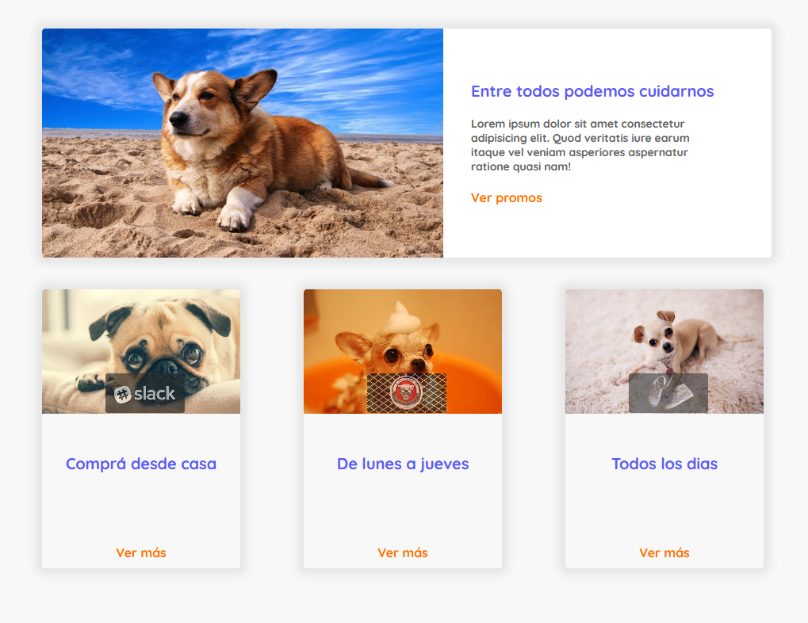
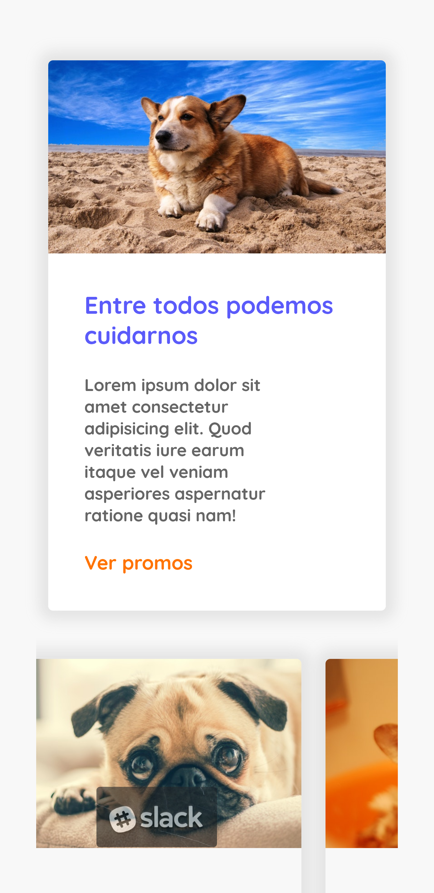
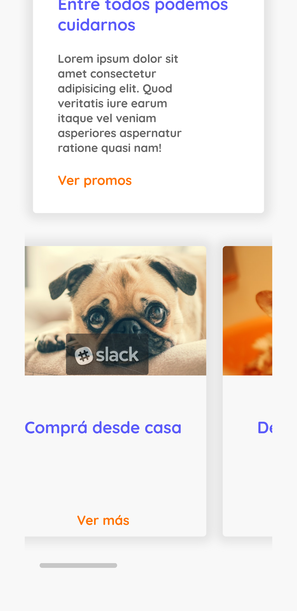
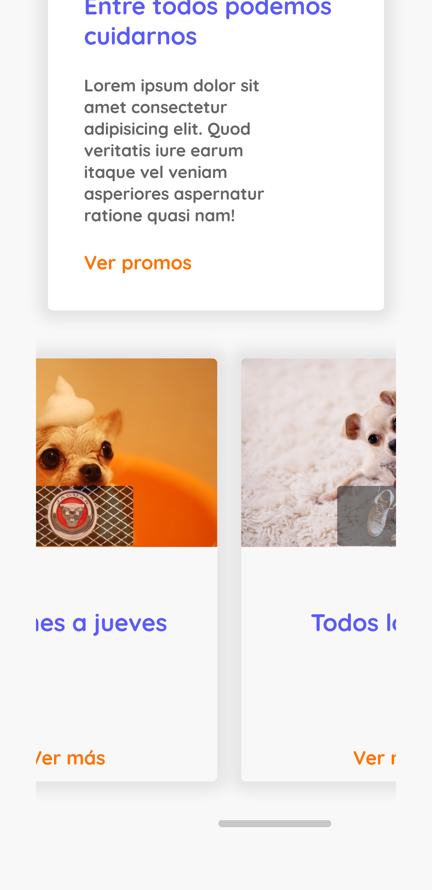
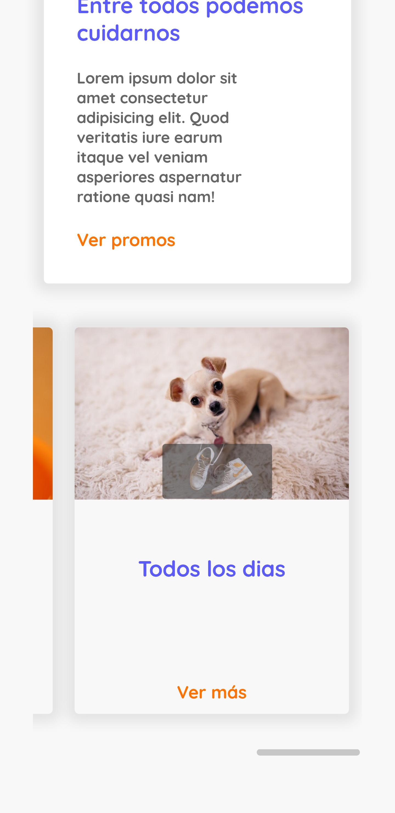

# TP-html-css-Publicidad

## About the code
This is one of the first tasks of my professional web master course in UTn Buenos Aires, it can be used as an example or template for future projects.

### ScreenShots  

## Responsive

## Responsive

## Responsive

## Responsive

### You can also see it like a site deploy at:
<a href="https://tp-doggys.netlify.app/">Site on netlify</a>

